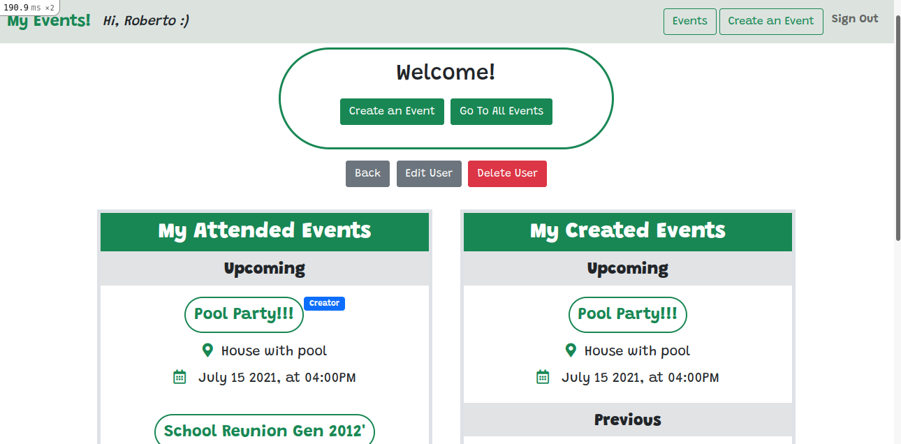

# Building an application for registering users and creating events

> I created a Ruby on Rails application for a site where users can create accounts (just with a username) and events, using ActiveRecord associations to create many to many relationships between the models.

- Consists of three models: user, event, and event_attending, five controllers: users, events, home, sessions, and event_attendings, and four main views: home, users, sessions, and events.
- User authentication and sessions are built from scratch.
- A user must registered and log in to be able to see the events, create and attend events.
- A user can edit or delete her/his own account, and her/his own events.
- A user can attend multiple events, and unattend them.

## Built With
- Ruby (v. 2.6.5)
- Ruby on Rails (v. 6.1.1)
- HTML / CSS (Bootstrap)
- Rubocop
- RSpec and Capybara for testing
- Git
 
## Setup
- Run 'bundle install'
 
## How to run it
* It's recommended to use Git's latest version.
* Clone or download the repo from here [private-events](https://github.com/Milypm/private-events.git) on your local system.
- Click on the "Code" green button and copy HTTPS URL.
- Go to your local system, on an empty folder, to clone the repo: 'git clone -HTTPS URL-'.
- Go to the repo folder.
- Install the dependencies: 'bundle install'.
- Migrate the database: 'rails db:migrate'.
- Start the server: 'rails server' or 'rails s'.
- Copy/open the path given to open the project in the browser: 'http://localhost:3000/'.
 
## Author
**Mily Puente** :woman_technologist:
- GitHub: [@Milypm](https://github.com/Milypm)
- LinkedIn: [Mily Puente](https://www.linkedin.com/in/milypuentem/)
 
## Contribute :point_left:
Any advice and suggestion for improvement are more than welcome.
Visit [issues' section](https://github.com/Milypm/private-events/issues)

## Show your support
Give a :star2: if you like this project!

